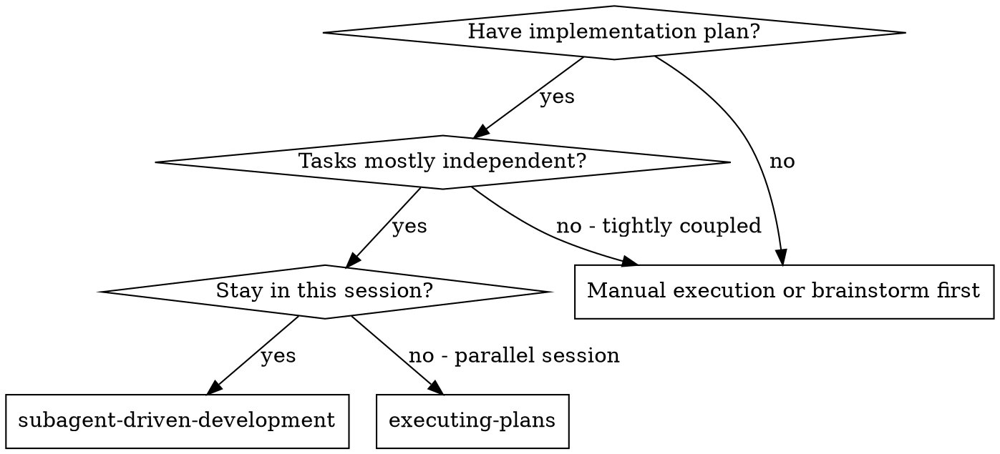
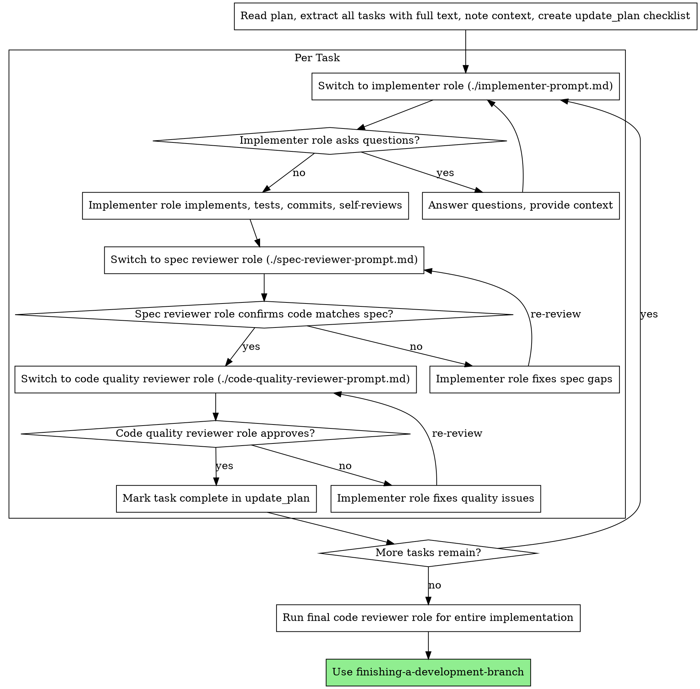

# Subagent-Driven Development (single-agent role switching)

Execute plan by role-switching per task (no subagents in Codex), with two-stage review after each: spec compliance review first, then code quality review.

**Core principle:** Role-switch per task + two-stage review (spec then quality) = high quality, fast iteration

## When to Use



**vs. Executing Plans (parallel session):**
- Same session (no context switch)
- Role-switch per task (no context pollution)
- Two-stage review after each task: spec compliance first, then code quality
- Faster iteration (no human-in-loop between tasks)

## The Process



## Prompt Templates

- `./implementer-prompt.md` - Switch to implementer role
- `./spec-reviewer-prompt.md` - Switch to spec compliance reviewer role
- `./code-quality-reviewer-prompt.md` - Switch to code quality reviewer role

## Example Workflow

```
You: I'm using Subagent-Driven Development (single-agent role switching) to execute this plan.

[Read plan file once: docs/plans/feature-plan.md]
[Extract all 5 tasks with full text and context]
[Create update_plan checklist with all tasks]

Task 1: Hook installation script

[Get Task 1 text and context (already extracted)]
[Switch to implementation role with full task text + context]

Implementer: "Before I begin - should the hook be installed at user or system level?"

You: "User level (~/.config/superpowers/hooks/)"

Implementer: "Got it. Implementing now..."
[Later] Implementer:
  - Implemented install-hook command
  - Added tests, 5/5 passing
  - Self-review: Found I missed --force flag, added it
  - Committed

[Dispatch spec compliance reviewer]
Spec reviewer: 鉁?Spec compliant - all requirements met, nothing extra

[Get git SHAs, dispatch code quality reviewer]
Code reviewer: Strengths: Good test coverage, clean. Issues: None. Approved.

[Mark Task 1 complete]

Task 2: Recovery modes

[Get Task 2 text and context (already extracted)]
[Switch to implementation role with full task text + context]

Implementer: [No questions, proceeds]
Implementer:
  - Added verify/repair modes
  - 8/8 tests passing
  - Self-review: All good
  - Committed

[Dispatch spec compliance reviewer]
Spec reviewer: 鉂?Issues:
  - Missing: Progress reporting (spec says "report every 100 items")
  - Extra: Added --json flag (not requested)

[Implementer fixes issues]
Implementer: Removed --json flag, added progress reporting

[Spec reviewer reviews again]
Spec reviewer: 鉁?Spec compliant now

[Dispatch code quality reviewer]
Code reviewer: Strengths: Solid. Issues (Important): Magic number (100)

[Implementer fixes]
Implementer: Extracted PROGRESS_INTERVAL constant

[Code reviewer reviews again]
Code reviewer: 鉁?Approved

[Mark Task 2 complete]

...

[After all tasks]
[Dispatch final code-reviewer]
Final reviewer: All requirements met, ready to merge

Done!
```

## Advantages

**vs. Manual execution:**
- Role switching follows TDD naturally
- Fresh context per task (no confusion)
- Parallel-safe (roles don't interfere)
- Role can ask questions (before AND during work)

**vs. Executing Plans:**
- Same session (no handoff)
- Continuous progress (no waiting)
- Review checkpoints automatic

**Efficiency gains:**
- No file reading overhead (controller provides full text)
- Controller curates exactly what context is needed
- Subagent gets complete information upfront
- Questions surfaced before work begins (not after)

**Quality gates:**
- Self-review catches issues before handoff
- Two-stage review: spec compliance, then code quality
- Review loops ensure fixes actually work
- Spec compliance prevents over/under-building
- Code quality ensures implementation is well-built

**Cost:**
- More role switches (implementer + 2 reviewers per task)
- Controller does more prep work (extracting all tasks upfront)
- Review loops add iterations
- But catches issues early (cheaper than debugging later)

## Red Flags

**Never:**
- Skip reviews (spec compliance OR code quality)
- Proceed with unfixed issues
- Dispatch multiple implementation roles in parallel (conflicts)
- Make role read plan file (provide full text instead)
- Skip scene-setting context (role needs to understand where task fits)
- Ignore role questions (answer before letting them proceed)
- Accept "close enough" on spec compliance (spec reviewer found issues = not done)
- Skip review loops (reviewer found issues = implementer fixes = review again)
- Let implementer self-review replace actual review (both are needed)
- **Start code quality review before spec compliance is 鉁?* (wrong order)
- Move to next task while either review has open issues

**If role asks questions:**
- Answer clearly and completely
- Provide additional context if needed
- Don't rush them into implementation

**If reviewer finds issues:**
- Implementer (same role) fixes them
- Reviewer reviews again
- Repeat until approved
- Don't skip the re-review

**If role fails task:**
- Switch to fix role with specific instructions
- Don't try to fix manually (context pollution)

## Integration

**Required workflow skills:**
- **writing-plans** - Creates the plan this skill executes
- **requesting-code-review** - Code review template for reviewer roles
- **finishing-a-development-branch** - Complete development after all tasks

**Roles should use:**
- **test-driven-development** - Use TDD for each task

**Alternative workflow:**
- **executing-plans** - Use for parallel session instead of same-session execution

